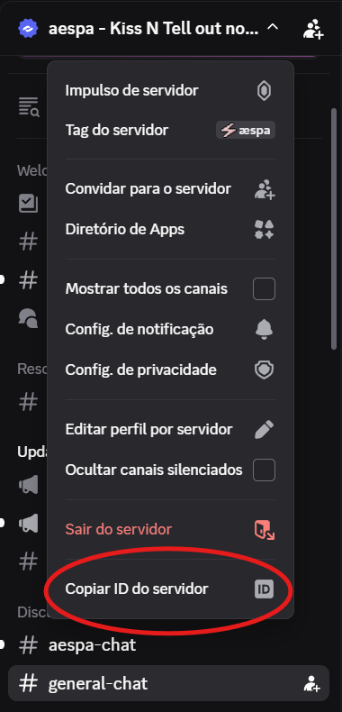

# Bot de captura de mensagens do Discord

Este projeto usa um bot oficial do Discord para coletar mensagens de um servidor. As mensagens capturadas podem ser do tipo `live`, para mensagens mineradas em tempo real, ou `historic`, que são mensagens capturadas via chamada GET. Ambos os tipos de mensagens são armazeados em .json na pasta `data/`.

Tabela de funcionalidades do Bot:

| Funcionalidade | Como funciona hoje |
| --- | --- |
| Captura ao vivo | Começa a salvar mensagens novas quando alguém usa `.minerar`. |
| Parar captura | Interrompe a mineração em tempo real com o comando `.parar`. |
| Buscar histórico | Captura X mensagens do um canal a partir do comando `.historico <num_de_mensagens>`. Se o número não for passado junto ao comando ele captura todas as mensagens de um canal desde de sua criação.|
| Identificar origem | Marca cada mensagem com `source`, usando `live` ou `historic`. |


## Sumário

- [1. Configurando seu Bot](#1-configurando-seu-bot)
   - [Criar o bot](#criar-o-bot)
   - [Configurar o bot](#configurar-o-bot)
   - [Adicionar o bot ao servidor](#adicionar-o-bot-ao-servidor)
   - [Pegar os IDs do servidor e do canal](#pegar-os-ids-do-servidor-e-do-canal)
- [2. Instalar as dependências e configurar o ambiente](#2-instalar-as-dependências-e-configurar-o-ambiente)
- [3. Executar o bot](#3-executar-o-bot)
- [4. Onde os dados ficam?](#4-onde-os-dados-ficam)
- [7. Dependências](#7-dependências)
- [8. Observações finais](#8-observações-finais)

## 1. Configurando seu Bot 
Para mais informações sobre os esse fluxo de criação de bot, consulte a documentação oficial: https://docs.discord.com/developers/topics/oauth2#bot-users

### Criar o bot

1. Acesse o [Discord Developer Portal](https://discord.com/developers/home).
2. Clique em **New Application**.
3. Dê um nome para a aplicação.
4. Abra a aba **Bot**.
5. Clique em **Add Bot**.
6. Copie o token do bot. Você vai usar esse valor no arquivo `.env`.

### Configurar o bot

1. Ainda na aba **Bot**, ative os intents privilegiados abaixo:
- `Presence Intent`
- `Server Members Intent`
- `Message Content Intent`
2. Salve as mudanças.

Importante: o script atual usa `discord.Intents.all()`. Por isso, esses intents precisam estar habilitados para o bot funcionar do jeito que o código espera.

### Adicionar o bot ao servidor

1. Abra **OAuth2 > URL Generator**.
2. Em **Scopes**, marque `bot`.
3. Em **Bot Permissions**, marque pelo menos:
- `View Channels`
- `Send Messages`
- `Read Message History`
4. Copie a URL e cole em uma aba do seu navegador.
5. Escolha o servidor em que o bot vai entrar.
6. Conclua a autorização.

> ⚠️ Atenção: você só pode adicionar o bot em servidores que você criou ou nos quais tem permissões de administrador.

### Pegar os IDs do servidor e do canal

1. No Discord, vá em **Configurações > Avançado** e ative **Modo Desenvolvedor**.
2. Clique com o botão direito no servidor e copie o ID do servidor.
3. Se quiser, clique com o botão direito em um canal e copie o ID do canal.



## 2. Instalar as dependências e configurar o ambiente

Na raiz do projeto:

```powershell
python -m venv .venv
.\.venv\Scripts\Activate.ps1
python -m pip install -r requirements.txt
```

Crie ou edite o arquivo `.env` na raiz do projeto com este conteúdo:

```env
DISCORD_BOT_TOKEN=cole_o_token_aqui
DISCORD_GUILD_ID=123456789012345678
DISCORD_CHANNEL_ID=123456789012345678
```


## 3. Executar o bot

Com o ambiente ativo, rode:

```powershell
python scripts/bot.py
```

Se a conexão der certo, o terminal mostra algo como:

```text
Bot conectado como MeuBot#1234.
Servidor alvo: MeuServidor (123456789012345678)

```
Pronto! Agora você pode testar seu bot no servidor em que ele está instalado :D

## 4. Onde os dados ficam?

As mensagens são salvas em `data/messages.jsonl`.

Esse arquivo cresce linha por linha. Cada linha é um JSON independente.

Exemplo de registro:

```json
{
   "id": 123456789012345678,
   "created_at": "2026-08-03T14:20:00+00:00",
   "edited_at": null,
   "guild_id": 111111111111111111,
   "guild_name": "MeuServidor",
   "channel_id": 222222222222222222,
   "channel_name": "geral",
   "author_id": 333333333333333333,
   "author_server_name": "usuario",
   "author_global_name": "Usuario Global",
   "bot": false,
   "content": "mensagem de teste",
   "mentions?": false,
   "mentioned_everyone?": false,
   "attachments": [],
   "type": 0,
   "source": "live"
}
```

O campo `source` pode ter dois valores:
- `live`: mensagem capturada enquanto o `.minerar` está ligado.
- `historic`: mensagem trazida pelo comando `.historico`.

Para mais informações sobre o objeto Mensagem, veja documentação oficial: https://docs.discord.com/developers/resources/message#get-channel-messages

## 7. Dependências

As dependências do projeto estão em `requirements.txt`:
- `discord.py`
- `python-dotenv`

## 8. Observações finais

Use sempre um bot oficial criado no Discord Developer Portal. Não use token de usuário e não tente rodar self-bot. Isso viola os termos da plataforma.

Se você for coletar mensagens de outras pessoas, deixe claro para o servidor que a coleta está acontecendo e qual será o uso desses dados.